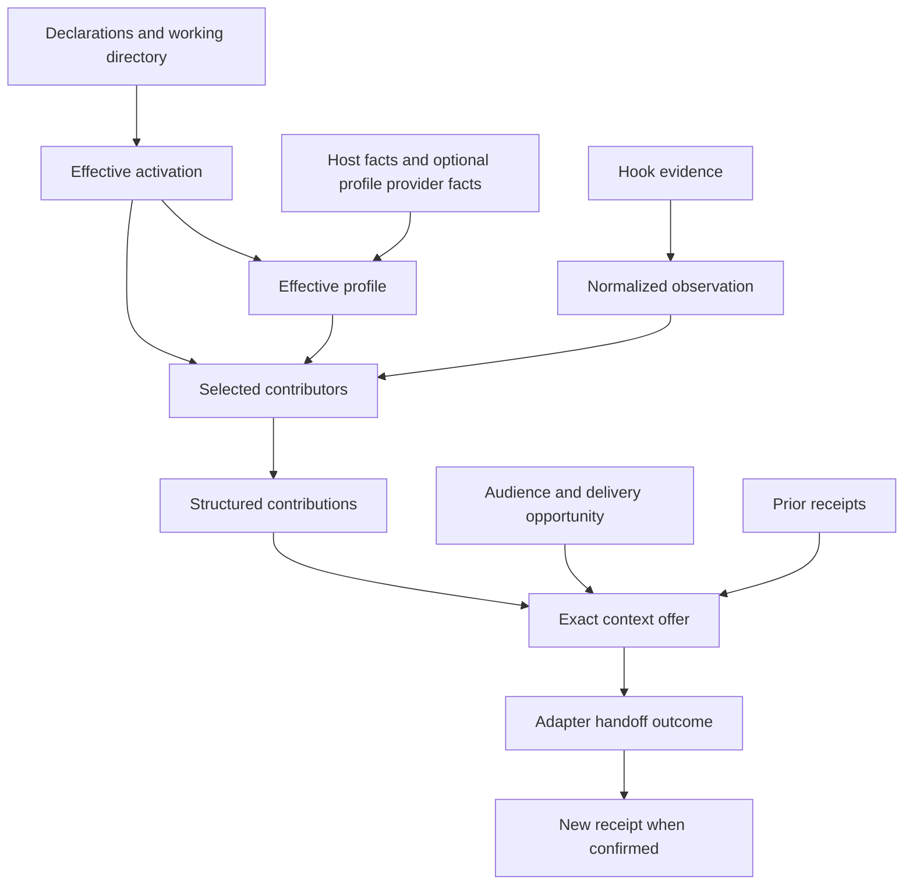

# ADR: Workbench context supplies relevant, explainable guidance through one global integration

- Status: Accepted
- Date: 2026-09-08
- Decision owner: Cole
- Scope: Product intent and high-level algorithms for `workbench context`.

This document defines the intended behavior against which implementations,
reviews, and usability sessions should be evaluated. It does not claim that the
commands or capabilities described here have shipped. Command spellings and RPC
examples illustrate the intended surface; their exact contracts belong to the
implementation.

## Give agents the right guidance without making users maintain every harness

An agent working in a repository should encounter relevant instructions when
its work makes them useful. A user should be able to improve those instructions,
add a context source, or change its applicability in that project without
editing each harness's global configuration. When guidance appears, the user
and the agent should be able to explain what appeared, when, and why.

The agent's activity is the query. Automatic context closes the gap where an
agent cannot retrieve guidance because it does not know that guidance exists.
Loading every rule up front instead consumes attention regardless of relevance.
Contributions should therefore provide the smallest useful guidance with a
clear source and a route to deeper material when needed. Success means better
informed next actions, not more injected text.

`workbench context` provides that shared context enrichment capability. The user
configures the supported harness integrations once, globally. Explicitly opted-in
working directories then select their own context magnets and profiles. Future
sessions using those configured integrations benefit automatically. Working
directories outside an enabled scope remain silent and unaffected.

For example, an agent reads a frontend component in an enabled project. The
project's context magnet selects the relevant architecture guidance. Workbench
offers it at a supported context boundary, records the handoff outcome, and can
later explain the file observation and profile rule that selected it. A reviewer
in another session can receive the same guidance independently. An agent working
in an unrelated, inactive directory sees none of this behavior.

The value is distributed across a small set of capabilities:

| Capability | Value to the user or agent |
| --- | --- |
| One global integration | Configure Claude Code and Codex once instead of maintaining a hook installation for every project. |
| Explicit directory activation | Extend an individual project's behavior without affecting unrelated work or changing global harness configuration. |
| Context magnets | Turn file access, searches, and other supported observations into relevant guidance from independently extensible sources. |
| Profiles | Select and adapt guidance to the project, task, and receiver using explainable configuration and facts. |
| Audience identification | Keep each receiving context's delivery history separate, so one agent's receipt cannot suppress another agent's guidance. |
| Context delivery | Bridge observation and injection opportunities, avoid unnecessary repetition, and preserve complete source attribution. |
| Explanation tools | Answer what happened and why with ample evidence, without requiring transcript retention or a sophisticated browsing UI. |
| Shared execution and bounded caches | Reuse useful computation while keeping hook latency, idle resource use, and retained history bounded. |

## The host owns the agent; Workbench supplies context

This feature is deliberately limited to context enrichment. It does not provide
durable messaging, recipient addresses, agent inboxes, task scheduling, turn
execution, or agent-to-agent communication. There is no agentd messaging
migration in this scope.

Hosts such as BB already own conversations and execution. Workbench accepts
observations and supplies context through an adapter; it does not reproduce the
host's work queue or use messages to simulate ambient context injection. The
core contract contains no BB thread, project, or scheduling model.

The supported integration target is Claude Code and Codex. Their necessary
observation and delivery hooks must work well and respond quickly. A general
contributor interface is valuable; supporting every harness is not a release
requirement. A host with suitable native observation and context admission APIs
may use a direct adapter later without changing the contributor contract.

This is also not an enforcement engine, a transcript archive, an agent memory
product, or an arbitrary automation framework. A contribution may describe a
command, but context enrichment does not execute that command on the agent's
behalf. Existing Workbench environment and source-delivery operations remain
independent of the context daemon.

## Install globally, activate only through explicit directory intent

Global setup installs the Go hook entrypoints into the supported harness
configurations. Repeating setup reconciles the integration rather than adding
duplicate hooks. The installed configuration refers to Workbench, not to each
project's individual contributors.

Installation alone does not enable context enrichment. Enablement comes from an
explicit project declaration or a user-home declaration selecting a directory
scope. A declaration must make its directory/subtree coverage legible, and
explicit exclusions must be respected. Merely being a Git repository, containing
guidance files, or having Workbench installed is not consent to activation.

User-home exclusions constrain project declarations. Within an allowed scope,
the nearest explicit project declaration refines inherited project settings and
user-home defaults; a nested declaration cannot override an applicable exclusion.
Unresolved conflicting declarations do not start providers and are inspectable.
Opt-in delegates selection and execution of project-configured context providers
within its declared scope, including later project changes. Setup must make that
delegation clear. Users may constrain the allowed providers in home configuration;
project configuration cannot widen those constraints. This delegation is what
allows project extension without repeatedly changing global harness setup.

Each hook invocation resolves its actual working directory against those
declarations. The resolution yields either an inactive result or an enabled
scope with effective configuration. Canonical path handling prevents equivalent
paths from creating accidental duplicate scopes; distinct worktrees retain
their separate configuration and content identities. Provider execution must
remain within the authority established by the user's installation and opt-in.

Activation has one interpretation shared by hooks and inspection. Status must
explain the winning declaration, inherited scope, exclusions, and configuration
conflicts without starting contributors. Explicit inspection can explain an
inactive directory even though ordinary hooks there produce no history.

The inactive result is a strict fast path: silent successful completion, no
context output, no daemon startup, no contributor execution, no transcript
inspection, and no project-local files or explanation records. The unavoidable
work is only the bounded Go invocation and activation lookup. Inactive hooks do
not keep an already running daemon or its providers warm.

For an enabled scope, Workbench derives the selected providers and profile from
the applicable declarations. Project changes take effect through that resolution;
they do not require editing global harness hooks or reinstalling the integration.
Activation caches must detect relevant changes, including newly added or removed
nearer declarations. An old negative lookup must not hide a later opt-in.
Withdrawal prevents subsequent context admission from that scope, including
previously queued guidance. Work already handed off cannot be recalled. Existing
runtime work is cancelled and pending items receive a withdrawn disposition;
inactive hooks themselves still create no explanation records.

## Compose observations, profiles, contributions, and delivery

The system is a dependency graph of facts and decisions. Configuration determines
applicability; observations recruit context; the receiving context and available
delivery surface determine what can be emitted.



These edges identify the inputs behind each decision. Each decision also
supplies bounded evidence to the explanation cache.

One Go process per OS user on each execution machine hosts the shared runtime.
The command-hook path is Go, including its activation check and provider envelope
handling. It must not launch a scripting runtime merely to discover that there
is no work. Contributors may use other languages and run on demand behind the
shared process. A remote checkout uses the runtime on its execution machine.
Enabled demand may start that process through one shared lifecycle owner;
concurrent hooks must not create competing daemons. Startup and recovery remain
bounded so daemon maintenance cannot stall a harness indefinitely.

| Owner | Responsibility |
| --- | --- |
| Harness adapter | Decode trusted hook evidence, identify the receiving context, expose delivery opportunities and budgets, and report exact handoff outcomes. |
| Workbench runtime | Resolve activation, compose profiles, manage provider lifetimes and caches, combine contributions, plan delivery, and expose explanations. |
| Context contributor | Select relevant content and provenance from normalized observations and profile facts; explain the selection. |
| Optional profile provider | Derive profile facts from granted inputs and explain their origin, validity, and any decay policy. |

The contributor boundary is a small JSON-RPC interface; subprocess stdio is the
initial transport candidate.
The basic operations are initialization, contribution, and shutdown. A provider
may additionally advertise audience profiling. One process can supply both
capabilities; an ordinary contributor need not implement profiling.

```text
initialize(configuration, supported capabilities)
audience.profile(context facts) -> profile facts + reasons     [optional]
context.contribute(observation, effective profile) -> contributions + reasons
shutdown()
```

Provider configuration and implementation can therefore change within a project
without teaching Claude Code or Codex a new protocol. Workbench supplies bounded
inputs and enforces response limits and deadlines. The RPC boundary is an
extension contract, not a sandbox for an executable running as the same user.

Workbench owns one context admission policy across all contributors. Contributors
cannot bypass its budgets or inject independently. Model-visible output identifies
the source and its authority: project-authored guidance remains project-authored
guidance, rather than becoming a harness instruction merely through delivery.

## Audiences prevent incorrect reuse; profiles improve relevance

An **audience** identifies the particular receiving context to which pending
guidance and receipts apply. The adapter supplies a scoped identity and a context
epoch when the host can establish resets. Workbench does not infer shared model
context from a shared working directory, profile, process, or durable thread ID.

Two agents can share parsed documentation and still have independent delivery
histories. A fork or reset must not inherit suppression unless the adapter can
establish the relevant context continuity. When continuity is unknown, a fresh
delivery history is safer than assuming earlier guidance remains available.

A **profile** describes which guidance is appropriate: for example, a reviewer
role, a project guidance set, or user-selected preferences. Workbench derives the
effective profile from explicit configuration, host facts, and configured profile
providers. Explicit choices take precedence over inferred defaults. Conflicting
facts and their resolution must be visible rather than silently decided by
provider completion order.
Each fact identifies its applicability, such as a directory, audience, or task,
and its validity inputs. Sharing a provider process does not make its facts
applicable to every request; facts from one scope cannot leak into another.

A contributor package may also provide profile identification. That does not
give it authority to identify another host's receiving context, confirm delivery,
or merge audience histories. Profile providers are selected from the initial
configuration; their activation cannot depend on the profile they have yet to
produce.

Profile facts may expire or decay only under a declared policy. A decay decision
must name its inputs and rule, such as time since relevant activity or a
provider-owned score calculation. There is no requirement for every profile to
have a score or decay algorithm. A profile change affects guidance selection; a
context reset affects receipt applicability; resource eviction affects residency.
These are distinct events with distinct explanations.

## Deliver complete guidance at the next usable boundary

Observation and delivery opportunity are independent. A hook may reveal relevant
activity without supporting context injection. Workbench can retain the resulting
structured contributions until a supported boundary offers room for them.

The selection algorithm applies the enabled providers to normalized observations
and the effective profile. Workbench combines their outputs in deterministic
order, coalesces equal semantic content while preserving its contributing sources,
and tracks source revisions separately from their stable contribution slots.
Stable evidence identifiers make replay idempotent where the harness supplies
them. The system must not manufacture an exactly-once claim when it does not.
If a bounded queue cannot accept an observation's contribution, its outcome is
explicit; an evidence cursor must not advance as though that contribution was
successfully incorporated.

The delivery algorithm selects complete source blocks within the adapter's
budget. Content that does not fit is deferred or explicitly rejected under a
bounded policy, never silently clipped into apparently complete instructions.
An empty selection produces no placeholder message. Repeated observations must
not turn a useful source into boilerplate that competes with the task.
A compact source reminder requires confirmed full-body delivery of that same
source and content to the same audience and context epoch. Equal text from a
different source is not that proof. Changed content requires a new content
identity.

An offer is not a receipt. The adapter first emits the exact offered content at
the supported boundary and then confirms that offer. Failed or uncertain handoff
must not create suppression. A crash after output but before confirmation may
cause a duplicate; that is preferable to falsely recording undelivered guidance.
A successful hook stdout write establishes local handoff, not proof that the
model understood the content or that a provider included it in a request.
Confirmation is bound to the exact offer, source revisions, audience, and epoch.
A delayed confirmation cannot clear a newer item in the same slot or suppress
guidance in a replacement context. Selection validity is checked again before
admission; profile or configuration changes can withdraw stale pending content.

Pending delivery and receipt bookkeeping belong to the delivery mechanism, not
to contributors or the explanation cache. The cache's 10 KB sampling limit never
controls the actual provider delivery budget or turns sampled text into guidance.

Provider failures, malformed optional contributions, and timeouts remain scoped
to their contribution and are explainable. They must not stop the agent's work
or prevent healthy contributors from serving it. Slow work cannot hold a global
lock that delays unrelated audiences. This feature does not promise unsolicited
delivery after an agent has stopped or durable custody of future agent work.

## State lifetimes preserve relevance without promising durable work

The baseline buffers context across short-lived hook invocations while
the shared runtime is alive. It does not require pending work or suppression
history to survive a runtime restart. That is a context-delivery recovery choice,
separate from excluding durable messaging and from explanation-cache retention.
After restart, missing suppression evidence permits a new full delivery; pending
guidance may be lost until relevant activity recruits it again. Inspection must
disclose the runtime generation and recovery boundary rather than imply seamless
delivery. A later persistence mechanism must preserve these authority and
validity rules without making explanation records into delivery state.

| Change | Profile facts | Pending guidance | Suppression evidence | Explanation history |
| --- | --- | --- | --- | --- |
| Configuration, source, or provider changes | Recompute affected facts from current inputs. | Revalidate affected items; replace or withdraw stale selections. | Applies only to the exact delivered source/content in its audience. | Retain original decision inputs while within retention. |
| Profile expiry or decay | Apply its declared validity rule. | Reconsider items depending on the changed facts. | Does not become a context reset. | Explain the rule, inputs, and resulting disposition. |
| Opt-in or provider authority withdrawn | Stop using withdrawn facts. | Withdraw affected items; no subsequent admission under withdrawn authority. | Records prior handoff, never permission for future admission. | Retained history may explain withdrawal; no new inactive-hook records. |
| Audience reset or unknown continuity | Revalidate audience-scoped facts. | Do not transfer blindly; recruit or revalidate for the new context. | Cannot suppress a fresh epoch. | Distinguish old and new receiving contexts. |
| Idle TTL or memory pressure | Evict derived facts; rebuild on demand. | Keep within a separate bound, or explicitly expire/reject with a reason; never silently discard during normal operation. | May be forgotten, permitting duplicate full delivery. | Rotation is independent of runtime residency. |
| Runtime restart | Rebuild from valid inputs. | Recovery is not required; declare the discontinuity. | If unavailable, assume no confirmed full delivery. | May start fresh; absent records prove nothing about earlier work. |
| Explanation cache cleared or rotated | No change. | No change. | No change. | Older evidence is unavailable and explicitly identified as such. |

Pending items have bounded size, count, and lifetime. A capacity or expiry
decision names what was rejected or lost while the runtime can record it; it
never becomes a receipt. Inspection access alone does not renew profile activity
or keep project providers warm. These rules allow idle resources to be released
without an indefinitely pinned queue or a fictional delivery guarantee.

## Explain decisions without retaining conversations

Explainability is a primary user and agent capability. A reviewer should be able
to inspect a contribution or profile transition and understand the actual
decision, not merely read a success message. The target is useful CLI and
structured inspection, not a sophisticated user-browsable transcript UI.

The shared runtime records bounded decision evidence in a disposable explanation
cache. Every important decision is explained by its owner: contributors explain
selection, profile providers explain their facts and decay, Workbench explains
activation and delivery planning, and adapters explain observed handoff outcomes.
Workbench does not invent missing provider rationale after the fact.

Absence is also an outcome to explain. Within enabled scopes, bounded observation
summaries distinguish no matching guidance, a provider that was not selected,
unavailable observation or delivery capabilities, and failed or deferred work.
Inspection reports what was actually observed; missing or rotated evidence must
never be presented as proof that nothing happened.

| Question | Evidence the feature should retain |
| --- | --- |
| What was contributed? | Contributor, source, content fingerprint, original byte length, and a bounded sample. |
| When was it contributed? | Timestamp, audience, context epoch, and an observed turn or invocation reference. |
| Why was it contributed? | Triggering observation, relevant profile facts, matched rule and configuration revision, and structured reason parameters. |
| Was it delivered? | Separate queued, offered, confirmed, suppressed, deferred, rejected, and failed outcomes with their reasons. |
| Why did a profile change or decay? | Previous and resulting facts, rule identity, relevant evidence, elapsed time or scores when used, and the applied thresholds. |
| What was this turn? | Host turn identity when available, observed boundaries, contribution/outcome counts, and causal references to its retained observations. |

The history stores neither complete prompts nor assistant messages nor complete
tool results. An observation retains only the bounded facts needed to understand
the context decision. A host turn groups those observations; it is not a copy of
the host's conversation. Where no turn boundary is exposed, inspection reports
hook invocations and unknown boundaries instead of inventing a turn.

For each contribution, the retained text is at most **10 KB total**. The sample
includes a head, several distributed middle excerpts, and a tail. Small bodies
fit in full; overlapping excerpts are merged. Original offsets, total byte length,
and omission counts make the sample's limits clear, and excerpts preserve valid
text boundaries. Samples preserve a useful gist, not a guaranteed reconstruction
of every instruction or qualification.

Reasons must remain useful after configuration changes. Retain the bounded rule
parameters and relevant fact values used at the time, alongside provenance and
revision references; a hash or a path to the current configuration alone cannot
explain an old decision. If causal evidence has rotated away, inspection says
so. Inferred facts, provider-reported reasons, and directly observed outcomes
remain distinguishable.

The intended inspection jobs are represented by commands such as:

```sh
workbench context status
workbench context history --audience A --limit 20
workbench context inspect contribution C
workbench context inspect turn T
workbench context explain profile P
workbench context cache status
workbench context cache clear
```

Read surfaces provide bounded, paginated structured output as well as human
output. Defaults scope to the current directory and disclose the resolved scope;
explicit options permit wider authorized inspection. A contribution inspection
answers what, when, why, and delivery outcome together. Missing evidence,
sampling, dropped records, and retention boundaries are visible. A caller should
not need to scan a multi-gigabyte log or follow many IDs to answer one question.

## Keep memory and explanation storage independently bounded

The explanation cache has a configurable **5 GB default total disk limit**, with
oldest history rotated out. The limit includes segments, dictionaries, indexes,
and write overhead; rotation must not leave permanent auxiliary growth. Here,
KB and GB denote 1,000 and 1,000,000,000 bytes respectively. Lower configured
budgets retain less history rather than weakening the bounds.

Use numeric event/reference IDs, reason codes, timestamps, durations, sizes, and
counts where possible. Reduce repeated string designations such as paths and
provider names while preserving meaningful text, especially samples and rule
names. Typed binary batches using Go's `encoding/gob`, string interning, and
independently readable segment blocks are candidate techniques. The requirement
is compact storage whose retained records remain interpretable after rotation,
with bounded reads and no dependence on deleted dictionaries. RPC readability
and disk representation need not match. Numeric values and repeated-data
reduction matter more than narrowing Go integer types.

This cache is not authoritative state. It can be removed freely, may start fresh
on reload, and requires no migration, replay, or per-event durability guarantee.
Deleting it removes explanation history, not authored configuration or active
delivery decisions. A cache generation distinguishes reused numeric IDs after a
reset. Corruption or write failure cannot block hooks; inspection must disclose
known gaps. The log is streamed to disk with bounded buffers and query memory;
the 5 GB disk allowance is not a 5 GB resident-memory allowance.

Runtime resources follow demand. Effective activation determines what may run;
observations determine what is needed; a configurable minutes-scale idle TTL
permits reuse before parsed data, indexes, and external provider processes are
released. Shared immutable data may be reused across compatible requests, while
audience-specific delivery state remains isolated. A separate global memory and
process budget bounds many simultaneously active projects; TTL alone is
insufficient. Resource eviction must not silently discard accepted pending
context or manufacture a delivery receipt.

Freshness is independent of idleness. Changes to configuration, files, provider
identity, or relevant dependencies invalidate cached derivations even while a
project stays active. No permanent process per working directory is required.
Concurrent hooks share activation work, and opted-out directories never trigger
provider warm-up. Fast-path and warm-path costs must not grow with the entire
retained explanation history.

## Review and usability evidence should prove the intended value

The feature succeeds when a user can configure the supported integrations once,
opt a project in, and obtain relevant guidance automatically with understandable
reasons and little interruption. The following outcomes define meaningful review
and commissioning evidence; they are not a report of completed tests.

| Scenario | Expected outcome |
| --- | --- |
| Install the integration, then work in an inactive directory | No context, daemon startup, project artifacts, or contributor execution; only the bounded activation check. |
| Opt a directory in and start a future Claude Code or Codex session | Relevant guidance appears automatically through the configured supported hooks, without another global configuration edit. |
| Add or change a project-local magnet or profile | Subsequent applicable observations use the new configuration; unrelated directories and global hooks remain unchanged. |
| Read a relevant file, then an unrelated file, and repeat the relevant read | Useful guidance is discoverable without prompting the agent to fetch it; unrelated activity adds no boilerplate; repetition follows the declared delivery policy. |
| Use two sessions in one project | Shared computation is possible, but each audience receives its own guidance and has separate receipts. |
| Observe guidance before an injection opportunity | Complete content becomes eligible at a later supported boundary; inspection distinguishes contribution from handoff. |
| Change a profile, let it expire, or evict its runtime | Inspection distinguishes those causes and shows the rule and facts responsible. |
| Ask what happened during a turn | Bounded inspection shows observations, contribution samples, reasons, and outcomes without requiring a transcript. |
| Expected guidance does not appear | Inspection distinguishes activation, selection, observation coverage, queueing, and handoff outcomes, or explicitly reports unavailable evidence. |
| Exhaust or clear the explanation cache | Disk use stays bounded; missing history is explicit; context operation continues. |
| Encounter a slow or failing provider | The agent loop and unrelated providers continue within bounded deadlines, with a scoped explanation. |
| Leave many projects idle, then return | Unneeded processes and caches are released; demanded resources are rebuilt with correct configuration and audience isolation. |

Performance evidence must cover inactive, cold, and warm hooks for both supported
harnesses, including concurrent invocations, total process-tree memory, idle
resource release, and bounded history inspection. Hook integration evidence must
exercise real provider boundaries; a mocked successful stdout write alone cannot
prove that useful context reaches a model request.

Acceptance must declare numerical pass/fail budgets and a reproducible workload:
machine and harness versions, directory depth, active audiences and projects,
provider count, input sizes, and retained history. Measure end-to-end hook
latency, including startup, decoding, evidence scanning, RPC, output, and cleanup,
along with total process-tree memory and process counts. State activation-change
visibility and idle-release deadlines. The acceptance evidence owns the measured
thresholds; saying only that work is bounded is insufficient.

Overload must produce bounded admission or rejection, not unbounded waiting or
new processes. A provider that ignores cancellation must be contained through
bounded termination and cleanup of its owned process tree. Repeated failures
must not create a restart storm or prevent healthy providers from making progress.
These cases, simultaneous daemon startup, and expired or stale confirmations
belong in the exercised workload.

Each supported harness adapter must publish its exercised observation and
delivery capabilities, identity/reset evidence, and budget units. A missing
capability is an explicit limitation, not a silent successful integration.
Usability evidence must include an agent encountering useful guidance before
the next action it is meant to inform, without being told where to find it,
and a user diagnosing both a contribution and its absence through ordinary
inspection commands. A later injection that misses that action demonstrates a
coverage limitation. Explanation evidence must survive changes to the original
configuration and partial history rotation. Sampling examples must include
multibyte text and important qualifications outside the excerpts, so inspection
demonstrates useful gist without implying the sample is complete guidance.

The work should be judged primarily on relevant automatic guidance, invisible
non-participation, easy project-level extension, fast hooks, and explanations
that answer actual questions. A broad harness catalog, elaborate UI, or durable
messaging subsystem cannot substitute for those outcomes.

## Relationship to Workbench's wider design

The [agent-native system design](../agent-system.md) establishes explainable
derived state, bounded capabilities, and disposable knowledge as Workbench
principles. The [agent control protocol](../agent-protocol.md) describes the
wider approach to structured inspection. This ADR applies those principles to
optional context enrichment; it does not make the daemon a prerequisite for
ordinary environment reconciliation or source delivery.

The protocol's proposed `workbench context --path` surface is explicit discovery;
this ADR adds automatic recruitment and inspection of its decisions. Both should
use the same applicable guidance and profile interpretation where their inputs
overlap. An explicit query does not establish a model-context delivery receipt
or enable ambient hooks. Final CLI naming must preserve these distinct jobs.

The external boundaries use the
[JSON-RPC request/response model](https://www.jsonrpc.org/specification).
The [Go gob documentation](https://pkg.go.dev/encoding/gob) describes the candidate
local binary encoding. These are implementation tools; the product guarantees
above are the reason to choose and evaluate them.
